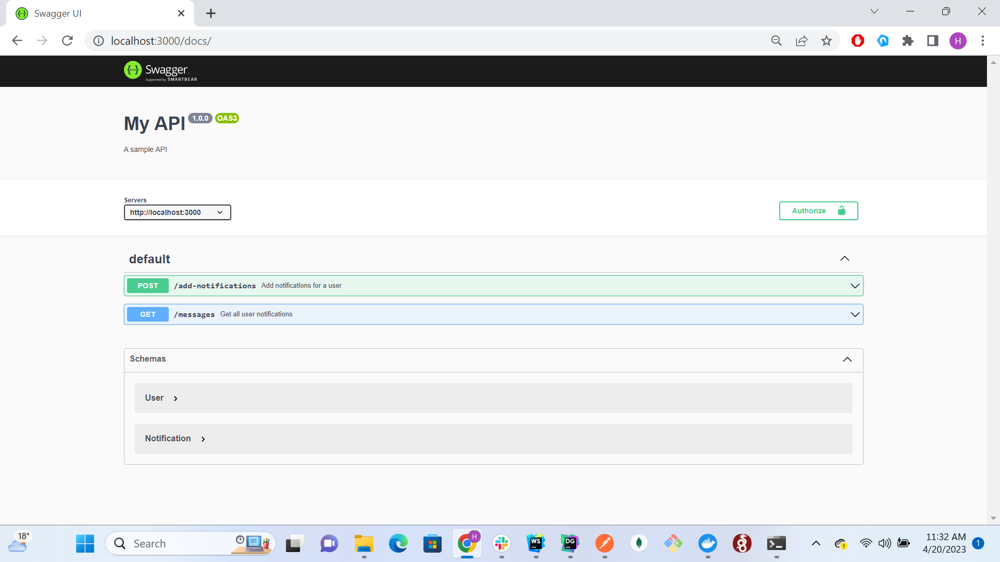

## Notification API


This is a simple API that allows users to add notifications and receive a list of their notifications. When a notification is added, an email is sent to the user using a mock email service.

### Installation and Setup

Clone the repository: git clone https://github.com/your-username/jagaad_task.git


Change into the project directory: cd jagaad_task

Run docker-compose file: docker-compose up

Install dependencies: npm install

Run the migration files to create the Users and Notifications tables: npm run migrate

Start the server: npm start

API Documentation

Base URL

The base URL for this API is http://localhost:3000.

You can check docs with writte OpenAPI http://localhost:3000/docs




Endpoints

POST /add-notifications

This endpoint is used to add notifications for a user. The request body must contain an email field and a notifications array.


Request Body

```json

{
  "email": "johndoe@example.com",
  "notifications": [
    "Notification 1",
    "Notification 2"
  ]
}
```

Response

```json

{
  "success": true
}
```

GET /messages

This endpoint is used to retrieve a list of notifications for a user.

Response

```json

[
  {
    "id": 1,
    "message": "Notification 1",
    "userId": 1,
    "createdAt": "2022-04-20T00:00:00.000Z",
    "updatedAt": "2022-04-20T00:00:00.000Z"
  },
  {
    "id": 2,
    "message": "Notification 2",
    "userId": 1,
    "createdAt": "2022-04-20T00:00:00.000Z",
    "updatedAt": "2022-04-20T00:00:00.000Z"
  }
]
```

Technologies Used

Node.js

Express

PostgreSQL

Sequelize

JSON Web Tokens (JWT)

Jest (for testing)


